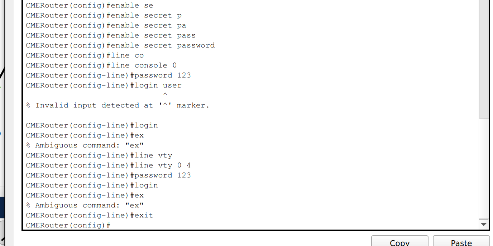
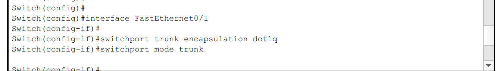

University: [ITMO University](https://itmo.ru/ru/)  
Faculty: [PIN](https://fict.itmo.ru)  
Course: [IP-telephony](https://itmo-ict-faculty.github.io/ip-telephony/)  
Year: 2023/2024  
Group: K34212  
Author: Fomintsev Denis Ruslanovich  
Lab: Lab2  
Date of create: 13.02.2025  
Date of finished: 13.02.2024  


## Отчет по лабораторной работе №2
### ["Конфигурация voip в среде Сisco packet tracer"](https://itmo-ict-faculty.github.io/ip-telephony/education/labs2023_2024/lab2/lab2/)

#### 1. Цель  
Иизучить построение сети IP-телефонии с помощью маршрутизатора Cisco 2811, коммутатора Cisco catalyst 3560 и IP телефонов Cisco 7960.

#### 2. Задачи Части 1

1. В конфигурационном режиме измените название маршру- тизатора на CMERouter.
2. Отключите синтаксис ввода слов от DNS серверов.
3. Задайте пароли для защиты маршрутизатора как в удаленном режиме, так и в режиме консоли.
4. Настройте интерфейс fa0/0 на маршрутизаторе Cisco 2811 (CMERouter).
5. Настроить DHCP сервера для передачи голоса и данных на маршрутизаторе Cisco 2811.
6. Настроить услуги телефонии Cisco CallManager Express на маршрутизаторе 2811.
7. Создать VLAN порты на коммутаторе Cisco Catalyst 3560 для взаимодействия коммутатора с маршрутизатором и подключить IP телефоны.
8. Настроить IP-телефоны и соединить с коммутатором Cisco Catalyst 3560.
9. Проверить звонки между телефонами и проверить остальные сервисы (перевод звонков, конференц-связь, перехват звонка).

#### 3. Задачи Части 2

1. Создать VLAN порты на коммутаторе для взаимо- действия коммутатора с маршрутизатором и подключить IP телефоны.
2. Задайте маршрут по умолчанию командой ip default-gateway.
3. Настройте порт как канал типа trunk.
4. Настроить DHCP сервера для передачи голоса и данных на маршрутизаторе Cisco 2811.
5. Настроить услуги телефонии Cisco CallManager Express на маршрутизаторе.
6. Настроить IP-телефоны и соединить с коммутатором.
7. Подключить конечные узлы устройств.
8. Проверить звонки между телефонами и проверить остальные сервисы (перевод звонков, конференц-связь, перехват звонка).

#### 4. Ход работы  

#### 4.1. Часть 1

Создана схема из 3-ёх IP-телефонов, 1-го маршрутизатора и 1-го L3 коммутатора

<p align="center"></p>

Переименован роутер и отключен синтаксис ввода слов от DNS серверов

<p align="center"></p>

Заданы пароли для защиты маршрутизатора как в удаленном режиме, так и в режиме консоли

<p align="center"></p>

<p align="center"></p>

Настроен FastEthernet 0/0 у маршрутизотора

<p align="center"></p>

Настроен DHCP сервер для передачи голоса и данных

<p align="center"></p>

Услуги телефонии Cisco CallManager Express на маршрутизаторе

<p align="center"></p>

<p align="center"></p>

<p align="center"></p>


#### 4.2. Часть 2


Преобразовываем схему

<p align="center"></p>

На switch ```ip default gateway 192.168.1.1``` к router

<p align="center"></p>

Настройка vlan и интерфейсов под них

<p align="center"></p>

<p align="center"></p>

<p align="center"></p>

<p align="center"></p>

По интерфейсам к телефонам ```switchport access vlan20``` и ```switchport voice vlan10```

<p align="center"></p>


Телефоны будут vlan10, PC будут vlan20  

<p align="center"></p>

<p align="center"></p>

Проверка

<p align="center"></p>
<p align="center"></p>

#### Вывод

Изучено построение сети IP-телефонии с помощью маршрутизатора Cisco 2811, коммутатора Cisco catalyst 3560 и IP телефонов Cisco 7960

