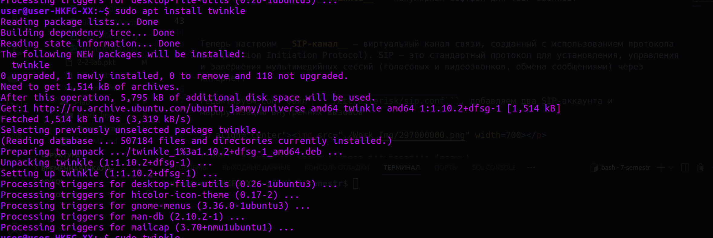

University: [ITMO University](https://itmo.ru/ru/)  
Faculty: [PIN](https://fict.itmo.ru)  
Course: [IP-telephony](https://itmo-ict-faculty.github.io/ip-telephony/)  
Year: 2025  
Group: K34212  
Author: Fomintsev Denis Ruslanovich  
Lab: Lab3  
Date of create: 15.02.2025  
Date of finished: 15.02.2024  


## Отчет по лабораторной работе №3
### ["Использование Asterisk в качестве SIP proxy"](https://itmo-ict-faculty.github.io/ip-telephony/education/labs2023_2024/lab2/lab2/)

#### 1. Цель  

Изучить программный комплекс Asterisk. Настройка Asterisk для локальных звонков.

#### 2. Задачи

1. Установить систему server.
2. Установить Asterisk.
3. Установить soft телефон на рабочую станцию.
4. Настроить SIP каналы.
5. Подключиться к SIP каналам soft телефона.
6. Сделать тестовый звонок на номер 1000


#### 4. Ход работы  

Устанавливаем Asterisk

__Asterisk__ — это открытая программная платформа для создания IP-АТС (телефонных станций) и VoIP-решений. Она позволяет организовывать голосовую связь, видеозвонки, конференции и другие коммуникационные сервисы через интернет (VoIP). Asterisk поддерживает множество протоколов, включая SIP, IAX, H.323 и другие

<p align="center"></p>

Установим программу одну из программ Softphone

__Softphone__ — это программное обеспечение, которое превращает компьютер, смартфон или планшет в виртуальный телефон. Оно позволяет совершать звонки через интернет (VoIP)

Для установки я выбрал __twinkle__ —  популярный софтфон для VoIP-звонков.

<p align="center"></p>

Теперь настроим __SIP-канал__ — виртуальный канал связи, созданный с использованием протокола SIP (Session Initiation Protocol). SIP — это стандартный протокол для установления, управления и завершения мультимедийных сессий (голосовых и видеозвонков, обмена сообщениями) через интернет. 

Редактируем conf файл ``` /etc/asterisk/sip.conf```, добавляем два SIP-аккаунта и маршрутизацию внутренних вызовов

<p align="center"></p>

[1000]: Уникальный идентификатор пользователя (логин).

* `type=friend`: Указывает, что этот аккаунт может как принимать, так и совершать звонки.

* `host=dynamic`: Позволяет пользователю регистрироваться с любого IP-адреса (например, с мобильного устройства или софтфона).

* `secret=1000`: Пароль для аутентификации.

* `context=ext_1000`: Контекст, в котором работает этот пользователь (определяет правила маршрутизации звонков).

[internal_calls]: Контекст для маршрутизации внутренних звонков.

* `exten => 1000,1,Dial(SIP/1001)`: Если набирается номер 1000, Asterisk попытается соединить вызов с устройством пользователя 1001.

* `exten => 1001,1,Dial(SIP/1000)`: Если набирается номер 1001, Asterisk попытается соединить вызов с устройством пользователя 1000.

А также файл ``` /etc/asterisk/extentions.conf```

<p align="center"></p>

[ext_1000]: Контекст, который определяет правила маршрутизации для пользователя 1000.

* `_XXXX`: Шаблон номера. Здесь X означает любую цифру от 0 до 9, а _XXXX — любой четырехзначный номер.  
* `1`: Приоритет выполнения команды (в данном случае первый шаг).  
* `Dial(SIP/EXTEN)`: Команда для установления звонка, подставляет номер, который был набран.  

Если пользователь 1000 набирает любой четырехзначный номер (например, 1001), Asterisk попытается соединить его с SIP-устройством, зарегистрированным под этим номером.

Перезапускаем сервер после изменения конфигурации и проверяем

```bash
systemctl restart asterisk
asterisk -rv 
```
```CLI> sip show peers```

<p align="center"></p>

Далее заходим в twinkle и создаем там 2 аккаунта

<p align="center"></p>

Сервер локальный ```127.0.0.1```. Приложение успежно устанавливает SIP

Проверяем, звонок идет, рингтон играет

<p align="center"></p>

Оба клиента онлайн

<p align="center"></p>

#### 5. Вывод  

В результате выполнения лабораторной работы удалось изучить программный комплекс Asterisk, настроить Asterisk для локальных звонков.